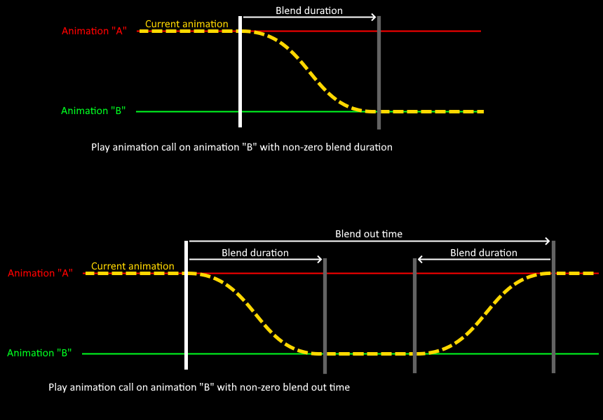

# AnimatedMultimeshInstance3D

Godot 4.5.1 project containing the addon adding AnimatedMultimeshInstance3D node and an example scene.

AnimatedMultimeshInstance3D extends Godot's MultimeshInstance3D.

It adds an ability to bake animations into a vertex and normal textures that can be played using the special shader.

This implementation of the vertex animation adds an ability to play a unique anmimation per instance with animation blending and a downsampling feature to reduce baked animation file size.

# Limitations

Animation baker doesn't support multiple surfaces. If your mesh has multiple surfaces, only the first one will be baked.

Multimesh doesn't have per instance LOD and culling.

I have set the limit for 8192 vertices and 8192 frames for the baker. These parameters directly affect animation texture size.

Frame count can be reduced by adjusting the sampling FPS. But the vertex count cannot be changed and you have to use external tools to lower the vertex count of your mesh.

Compatibility render mode doesn't support animation blending.

## Notes

The model from example contains 3986 vertices (which is a lot for such a simple model) and you can feel the game struggling already at 5k+ instances depending how strong is your GPU.

Personally, I'm using models with less than 500 vertices. That allows me to have around 50k instances with a steady 100 FPS with my GPU (GeForce RTX 2070 SUPER).

When using long blend times, the mesh can warp in unwanted ways. Here is a bad example at 3 second blend time:

It's unnoticeable at distance, but if you want to use the animation blending up close, lower the blend time or adjust your source animation to reduce this effect.

# How to use it

Start by downloading and opening the project.

It contains a demo scene at the path `res://basic_demo/scene/example_scene.tscn` that you can test and explore.

To recreate the AnimatedMultimeshInstance3D at your own project, first **make a backup of your project**.

Then, copy the directory `animated_multimeshinstance3d` from `res://addons/` folder to the addon folder in your project.

Open a scene where you want to add the animated multimesh. Create a node AnimatedMultimeshInstance3D inside your scene. Select the node and see the inspector.

Optinally, you can change the "Sampling FPS" to set the baker sampling rate. Since the shader will interpolate the values anyway, the sampling FPS should be kept as low as possible to reduce animation texture size.

Import an animation into your project or use existing one. Make sure it shows up as a "PackedScene" inside Godot's FileSystem. Animation scene must contain AnimationPlayer and MeshInstance3D nodes. Make sure the animations are played correctly when you play them in the inspector window. 

Once you import the animation, drag and drop it into "Packed Animation" property. New properties will show up, allowing you to select relative paths to the nodes within the packed scene. 

Enable "Custom Output Directory" to change the output path. By default, the output is saved in the same directory as PackedScene containing your animation.

Press "Bake". If errors or warnings show up, they should tell you what you should change in the parameters.

The correct output should look like this:

Once the animation is baked, new Multimesh should be set and material override should contain a ShaderMaterial with all parameters set. Albedo texture for the material must be set manually inside the material.

AnimatedMultimeshInstance3D acts like the regular MultimeshInstance3D. Use instance_count inside multimesh to change mesh count.

## Methods to operate with the animations

To retrieve a list of animation names from AnimatedMultiMeshInstance3D use  
`get_animation_list()`

To retrieve an animation name of the currently played anmiation use  
`get_current_animation_name(instance : int)`

To play an animation by name use  
`play(instance : int, animation_name: StringName = &"", blend_duration : float = 0.0, blend_out_time : float = 0.0)`

To sync AnimatedMultiMeshInstance3D animation with AnimationPlayer use [AnimationPlayer.seek()](https://docs.godotengine.org/en/stable/classes/class_animationplayer.html#class-animationplayer-method-seek) with  
`get_current_animation_timestamp(instance : int):`

To retrieve an animation data (MultimeshAnimationData) of currently played animation use  
`get_current_animation(instance : int)`

To play a custom animation from data use  
`play_custom(instance : int, animation : MultimeshAnimationData, blend_duration: float = 0.0, blend_out_time : float = 0.0)`

Here is a picture I made to explain what blend_duration and blend_out_time parameters mean.  

Note that when using blend out time "get_current_animation" method retrieves the original animation (animation "A" in this case), since the animation is blended back to the original one.

If you want to create a custom animation processing solution, you can use method combine_custom_buffer and send buffer data to multimesh directly.  
`combine_custom_buffer(main_animation : MultimeshAnimationData, blended_animation : MultimeshAnimationData , blend_duration : float = 0.0, blend_out_time : float = 0.0)`

## BulkAnimatedMultimeshControl

I added a utility node called BulkAnimatedMultimeshControl as an example of how to use AnimatedMultimeshInstance3D.  
It allows you to scatter animated meshes in a volume randomly. It picks and plays random animations from the animation list.

Feel free to copy and modify the code to suit your project needs.

## Comprehensive demo

I included a more complex demo located at `res://syncing_and_collision_demo/scenes/syncing_and_collision_demo_scene.tscn`.

It features:
- Bulk multimesh control, managing transforms and animations for large amount of entities;
- Entity movement, avoidance, state machine, aggro and attacking player;
- Syncing attack and death animation;
- Shooting and accurate per-instance raycast physical bone collision detection;
- Turning dead entities into static corpses to boost performance.

## License

Copyright notice is located in `LICENSE.txt`.  
Source code is licensed under MIT license.  
Ghoul model and texture are licensed under CC BY-NC 4.0 license.
